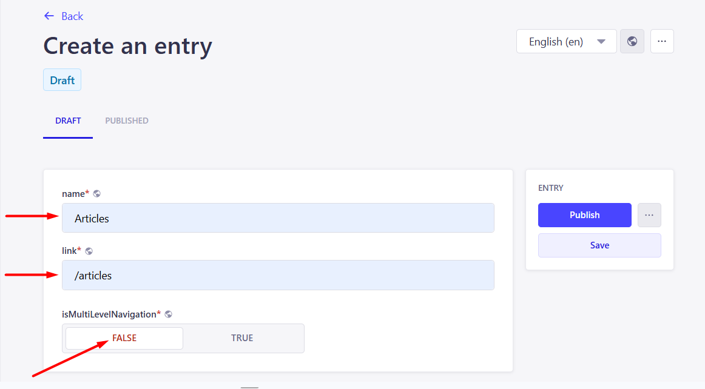

# Instructions for managing content on the home site via CMS Strapi

## Content:
1. 

<h2 id="navigation">Navigation</h2>

<h3 id="location-navigation-tab">Location of the navigation tab</h3>

<h3 id="create-single-level-navigation">Creating a single-level navigation</h3>

To create a single-level navigation, click the "Create new entry" button in the navigation section.

*Creating new entry*

To create a single-level navigation, fill in the `name`, `link` field and set false in `isMultiLevelNavigation`.

Then click on the publish button.

*Creating single-level navigation*

<h3 id="create-multi-level-navigation">Creating multi-level navigation</h3>

To create a multi-level navigation, click the "Create new entry" button in the navigation section.

*Creating new entry*

*Creating multi-level navigation*

To create multi-level navigation, fill in the `name`, set **true** in `isMultiLevelNavigation` and select the navigation that you want to attach in `navItems` field.

Then click on the publish button.

>You can only attach single-level navigation in navItems. Attaching multi-level will not work here.

<h3 id="add-navigation-to-header">Adding navigation to header</h3> 

To see the added navigation in the site header, go to the **Layout** tab and add the desired navigation in the `navigationLists` header field.

Then click on the publish button.

*Adding navigation to header*

<h3 id="add-navigation-to-footer">Adding navigation to footer</h3>

To see the added navigation in the site footer, go to the **Layout** tab and do the following:

1. Add section with navigation in `navigationLists`
2. Fill caption and set **false** in `isSocialNetworks` field
3. Add the desired navigation in the `links`

*Adding navigation to footer*