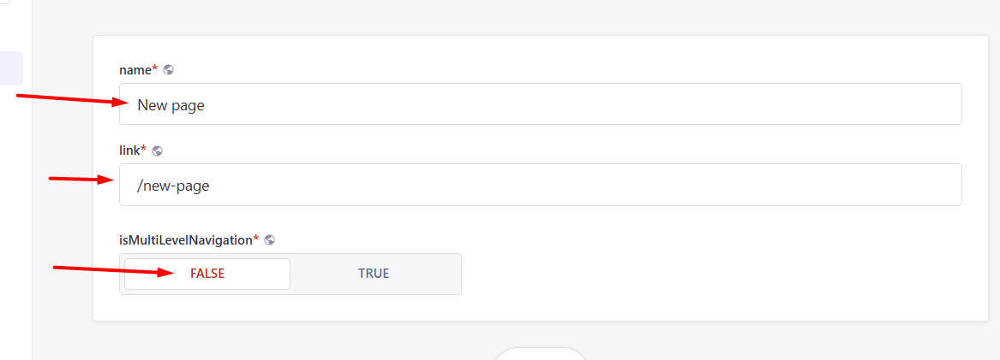
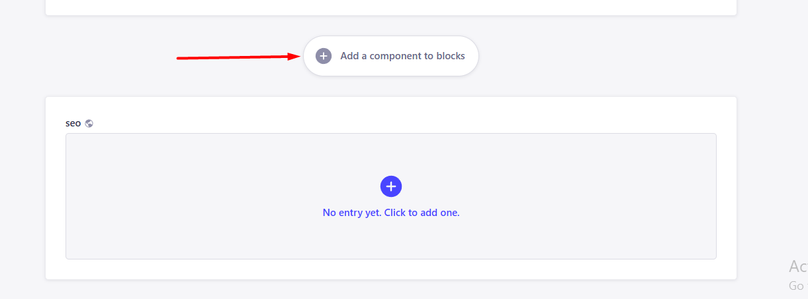
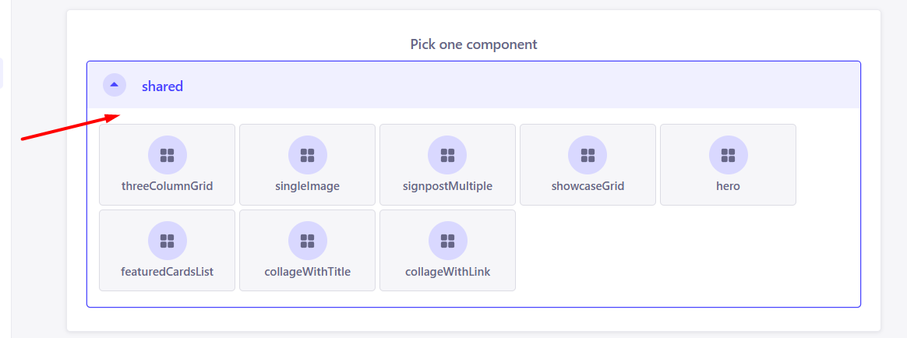
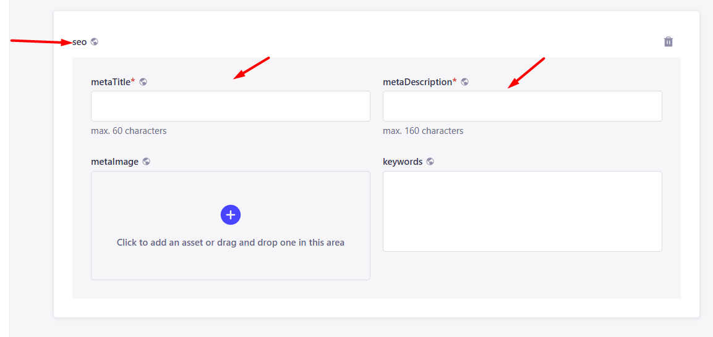

# Instructions for managing content on the home site via CMS Strapi

## Content:
1. [General information](#general-information) 
    1.1. [Draft and published version of the content](#draft-and-published) 
    1.2. [Filling in content in different languages](#different-languages) 
2. [Existing components](#existing-components)
3. [Navigation](#navigation) 
    3.1. [Location of the navigation tab](#location-navigation-tab) 
    3.2. [Creating a single-level navigation](#create-single-level-navigation) 
    3.3. [Creating multi-level navigation](#create-multi-level-navigation) 
    3.4. [Adding navigation to header](#add-navigation-to-header) 
    3.5. [Adding navigation to footer](#add-navigation-to-footer) 
4. [Social network](#social-networks) 
    4.1. [Location of the social networks tab](#location-social-networks-tab) 
    4.2. [Creating a social network](#create-social-networks) 
    4.3. [Adding social networks to header](#add-social-networks-to-header) 
    4.4. [Adding social networks to footer](#add-social-networks-to-footer) 
5. [Homepage](#homepage) 
    5.1. [Location of the homepage tab](#location-homepage-tab) 
    5.2. [Filling in the homepage](#filling-in-the-homepage) 
6. [Layout](#layout) 
    6.1. [Location of the layout tab](#location-layout-tab) 
    6.2. [Filling in the layout](#filling-in-the-layout) 
7. [Adding new pages](#adding-new-pages)

<h2 id="general-information">1. General information</h2>

<h3 id="draft-and-published">1.1. Draft and published version of the content</h3>
All content in the CMS has a draft version and a published version.

- The published version is visible to everyone.
- The draft version can be viewed in the CMS or in the preview mode.

You can switch between them.

To view the content in draft mode and not publish it, you need to click on the "Save" button, and then "Open draft preview".

<h3 id="different-languages">1.2. Filling in content in different languages</h3>

All CMS content can be filled in in different languages, and you can select the language using the language switch.

To fill in content in different languages, fill in the content in one language first, save it, and then switch to another language.

If you want to transfer all the completed content from another language so as not to fill everything in from the beginning, click on the button next to the language switch.

In the window that opens, select the language you want to copy the content from and confirm your choice.

<h2 id="existing-components">2. Existing Components</h2>

1. [Hero](https://www.tourmalinecore.com/components/hero)

2. [FeaturedCardList](https://www.tourmalinecore.com/components/services)

3. [CollageWithTitle](https://www.tourmalinecore.com/components/collage-with-title)

4. [CollageWithLink](https://www.tourmalinecore.com/components/collage-with-link)

5. [SignpostMultiple](https://www.tourmalinecore.com/components/signpost-multiple)

6. [SingleImage](https://www.tourmalinecore.com/components/single-image)

7. ShowCasesGrid: 
  7.1. [With markdown columns](https://www.tourmalinecore.com/components/projects-with-text-block)  
  7.2. [Three columns](https://www.tourmalinecore.com/components/projects-with-three-cards) 
  7.3. [Four columns](https://www.tourmalinecore.com/components/projects-with-four-cards)

8. [ThreeColumnGrid](https://www.tourmalinecore.com/components/cards-grid)

9. [Form](https://www.tourmalinecore.com/components/form-block)

<h2 id="navigation">3. Navigation</h2>

<h3 id="location-navigation-tab">3.1. Location of the navigation tab</h3>

To get to the navigation tab, first you need to go to the content manager tab.

Then go to the navigation tab.

<h3 id="create-single-level-navigation">3.2. Creating a single-level navigation</h3>

To create a single-level navigation, click the "Create new entry" button in the navigation tab.

To create a single-level navigation, fill in the `name`, `link` field and set false in `isMultiLevelNavigation`.

Then click on the publish button.

<h3 id="create-multi-level-navigation">3.3. Creating multi-level navigation</h3>

To create a multi-level navigation, click the "Create new entry" button in the navigation section.

To create multi-level navigation, fill in the `name`, set **true** in `isMultiLevelNavigation` and select the navigation that you want to attach in `navItems` field.

Then click on the publish button.

>You can only attach single-level navigation in navItems. Attaching multi-level will not work here.

<h3 id="add-navigation-to-header">3.4. Adding navigation to header</h3> 

To see the added navigation in the site header, go to the **Layout** tab and add the desired navigation in the `navigationLists` header field.

Then click on the publish button.

<h3 id="add-navigation-to-footer">3.5. Adding navigation to footer</h3>

To see the added navigation in the site footer, go to the **Layout** tab and do the following:

1. Add section with navigation in `navigationLists`
2. Fill `caption` and set **false** in `isSocialNetworks` field
3. Add the desired navigation in the `links`

<h2 id="social-networks">4. Social networks</h2>

<h3 id="location-social-networks-tab">4.1. Location of the social networks tab</h3>

To get to the social network tab, first you need to go to the content manager tab.

Then go to the social networks tab.

<h3 id="create-social-networks">4.2. Creating a social network</h3>

To create a social network, click the "Create new entry" button in the social networks tab.

To create a social network, fill in the fields `name`, `link`.

Then click on the publish button.

<h3 id="add-social-networks-to-header">4.3. Adding social networks to header</h3> 

To see the added social networks in the site header, go to the **Layout** tab and add the desired social networks in the `socialLinks` header field.

Then click on the publish button.

<h3 id="add-social-networks-to-footer">4.4. Adding social networks to footer</h3>

To see the added social networks in the site footer, go to the **Layout** tab and do the following:

1. Add section with navigation in `navigationLists`
2. Fill `caption` and set **true** in `isSocialNetworks` field
3. Add the desired social networks in the `socialLinks`

<h2 id="homepage">5. Homepage</h2>

<h3 id="location-homepage-tab">5.1. Location of the homepage tab</h3>

To get to the homepage tab, first you need to go to the content manager tab.

Then go to the homepage tab.

<h3 id="filling-in-the-homepage">5.2. Filling in the homepage</h3>

You can add components to the homepage by clicking on the "Add a component to blocks" button.

After that, you will see all the possible components, they can be added in any order and in any quantity.

The appearance of the components can be viewed in this [section](#existing-components).

To publish a page, you need to complete seo so that the page is indexed well by search engines.

<h2 id="layout">6. Layout</h2>

<h3 id="location-layout-tab">6.1. Location of the layout tab</h3>

To get to the layout tab, first you need to go to the content manager tab.

Then go to the layout tab.

<h3 id="filling-in-the-layout">6.2. Filling in the layout</h3>

Layout contains a header and footer content.

The header has the fields `navigationLists` and `socialLinks`, they contain an entry from the [navigation](#navigation) and [social networks](#social-networks) section.

The footer in `navigationLists` has the fields `link` and `socialLinks`, they contain an entry from the [navigation](#navigation) and [social networks](#social-networks) section.

After filling in all the necessary fields, you can publish.

<h2 id="adding-new-pages">7. Adding new pages</h2>

New pages are added in the navigation tab.

To create new page, click the "Create new entry" button in the navigation tab.

Fill in the `name`, `link` field and set *false* in `isMultiLevelNavigation`.

Add the necessary components to the page and fill them in.

>Be sure to fill out the seo

Then you can click on the publish button.

You can see how to add a new page to the header [here](#add-navigation-to-header).

You can see how to add a new page to the footer [here](#add-navigation-to-footer).